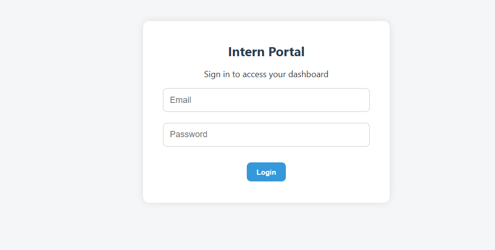
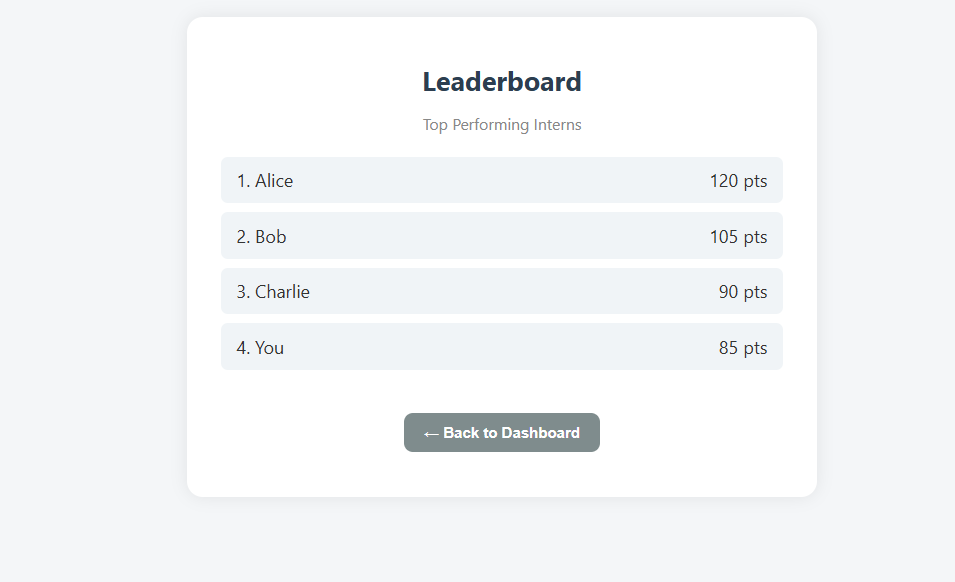

# 🌟 Intern Fundraising Dashboard

A simple and elegant dashboard for fundraising interns that displays referral code, total donations raised, rewards, and a leaderboard. Built with React, styled with CSS, and powered by a dummy backend.

---

## 📌 Features

- 🔐 Dummy Login (no authentication)
- 📊 Personalized Dashboard
  - Intern Name: **Vishal**
  - Referral Code: `vishal2025`
  - Total Donations Raised: ₹7320
  - Rewards / Unlockables (static)
- 🏆 Leaderboard (static top fundraisers)
- 🔄 Routing between all pages

---

## 💻 Tech Stack

- **Frontend:** React, React Router, CSS Modules
- **Backend:** JSON Server (or mock API)
- **Routing:** React Router DOM

---

## 🛠️ Local Setup Instructions

### 1. Clone the Repository

```bash
git clone https://github.com/your-username/intern-dashboard.git
cd intern-dashboard
```

### 2. Run Frontend

```bash
cd frontend
npm install
npm start
```

### 3. Run Backend (JSON Server)

```bash
cd ../backend
npm install -g json-server
json-server --watch db.json --port 3001
```

### 📡 API Endpoints

- `GET /user` → Returns user info (name, referral code, donation amount)
- `GET /leaderboard` → Returns static leaderboard data

---

## 📸 Screenshots

### 🔐 Login Page


### 📊 Dashboard


### 🏆 Leaderboard


---

## 👨‍💻 Author

- **Name:** Vishal 
- **GitHub:** [github.com/SonSpy](https://github.com/SonSpy)

---
